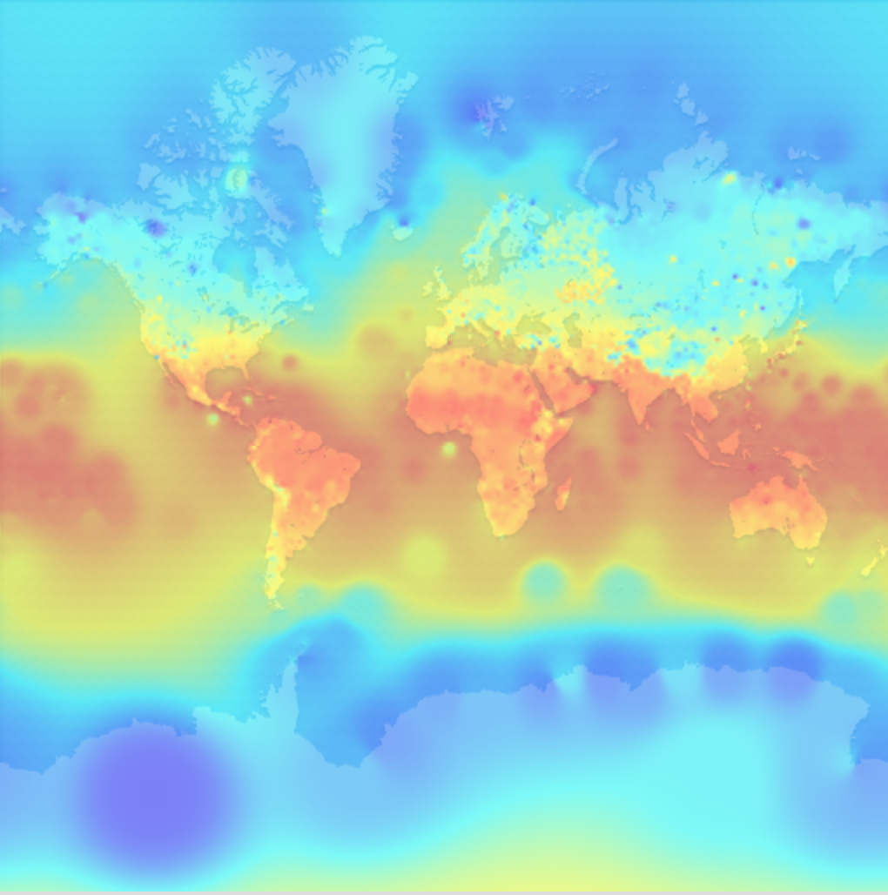
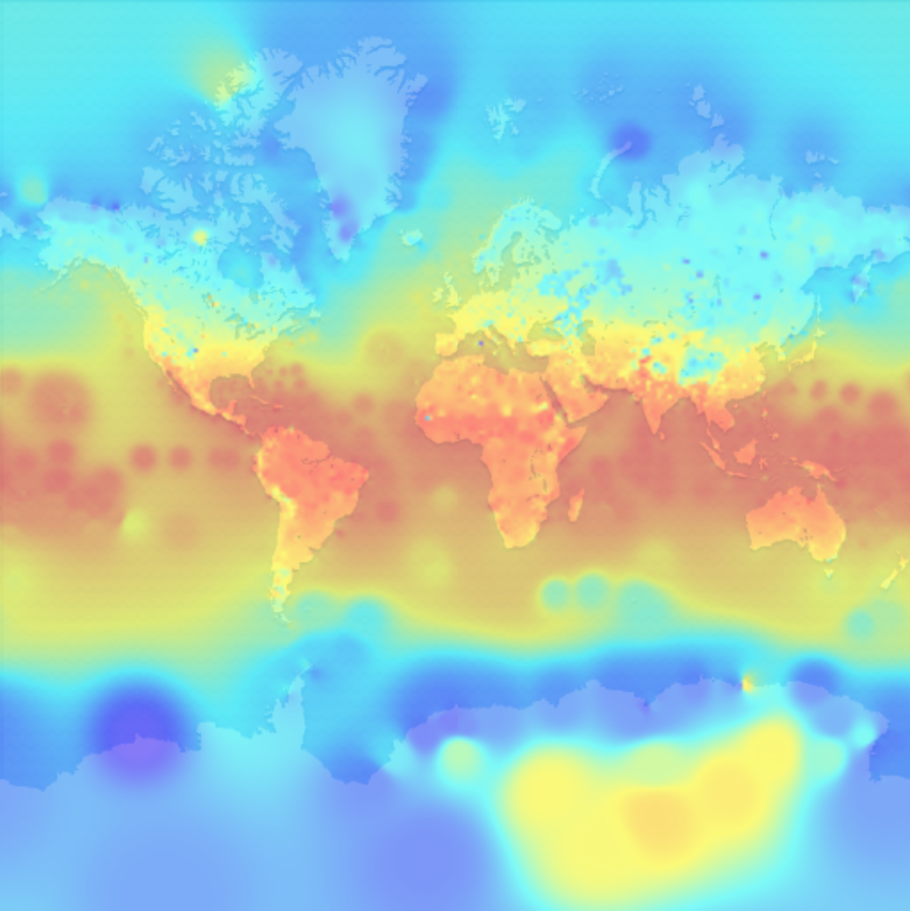

# Big-Data-Weather-Analysis

## Summary

This is a project meant to apply data processing skills to a relatively data-intensive application using real-world data from the [National Center for Environmental Information of the United States](https://www.ncei.noaa.gov/). It involves cleaning raw data, extracting useful information from it, and using spatial and linear interpolation techniques to visualize the data. An example of this is the average temperature of each point of the globe over each year, which is represented below using the following scale:

**Scale**:

**Average temperatures across the globe in 1975**:

**Average temperatures across the globe in 2015**:

## The Process

This project is for the "Functional Programming in Scala Capstone." It serves as a way for individuals to show what they have learned in the courses prior while also giving as much freedom as possible in the solution space.

For this project, I used Apache Spark.
